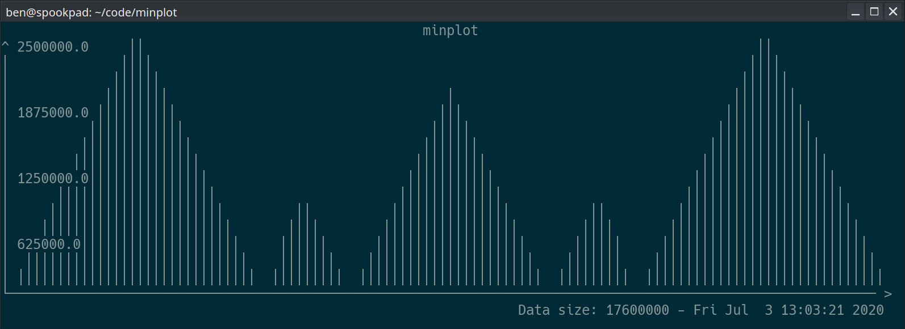

# minplot

minplot is a simple command-line utility for plotting large amounts of data from stdin. This project was inspired by the ttyplot utility, and borrows many elements from it.

minplot is designed to summarize data points (e.g. from a logfile) and plot the data within the terminal rather than plotting discrete data points. If minplot is given more values than can be plotted within the terminal, it will downsample the data based on the terminal size and plot the "shape".

Here's an example of plotting 17.6M data points which range from 0 to 2500000 - the data is neatly summarized despite the limited resolution of the terminal:


# Usage
minplot takes newline-separated numeric data from stdin. For example, the following command would plot values from 0 to 1000 as generated by the standard `seq` util:

```
seq 0 1000 | ./minplot
```

# Building
minplot is designed to be lightweight and portable across Linux systems. The utility is written in C and has no dependencies besides gcc.
```
git clone https://github.com/bmoyer/minplot
cd minplot
make
```

# TODO
- Handle negative data
- Reduce memory footprint
- Allow user to 'zoom in' on portions of the data
- Allow keyboard input for quitting, toggling axis markers, etc.
- Allow more diverse input from stdin, possibly units
- Handle terminal resizes better
- Allow X-axis to represent things other than sample number: e.g., some user-given per-data-point X-value, or timestamp
- Start Y-axis at minimum value in data set rather than 0
